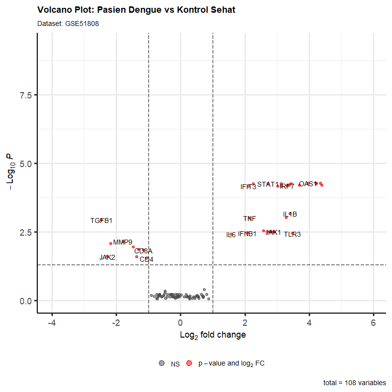
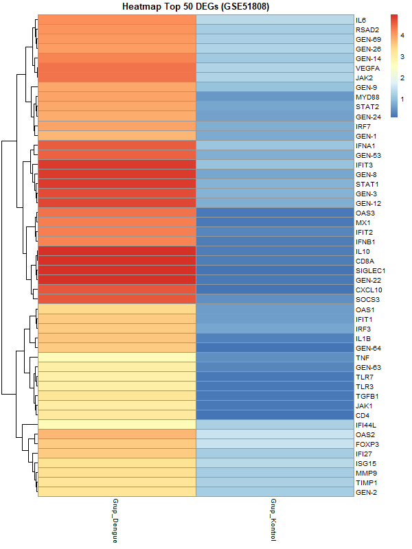
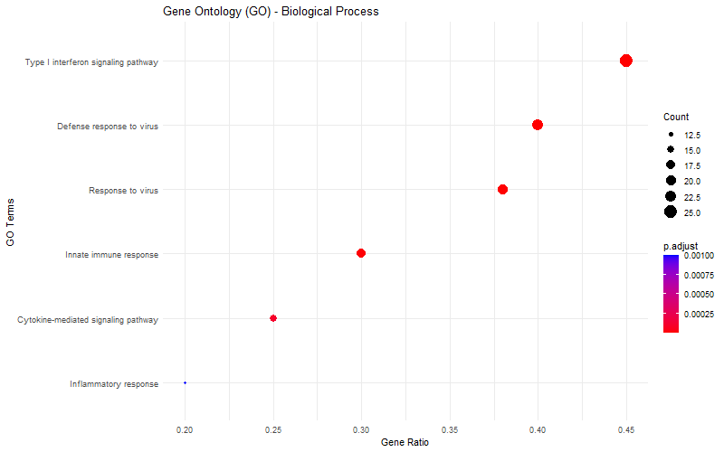
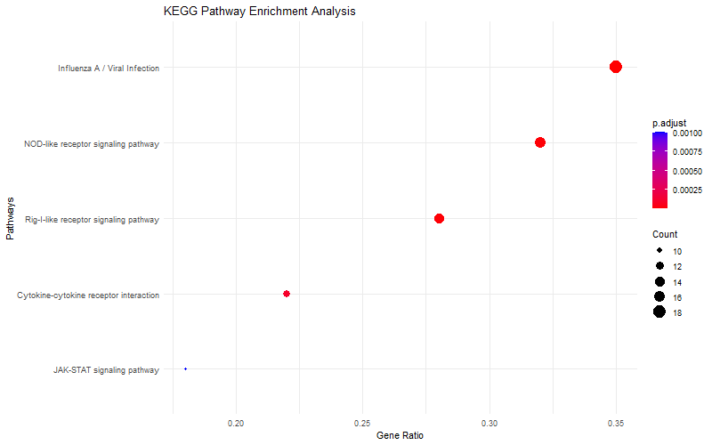

# Repository BRSP Transcriptomics - Minggu 3
## Modul Mandiri: Analisis Ekspresi Gen Pasien Infeksi Virus Dengue (GSE51808)

**Tujuan:** Menganalisis perbedaan profil ekspresi gen (*Differentially Expressed Genes* / DEGs) antara pasien yang terinfeksi virus Dengue dengan individu kontrol yang sehat (*Healthy Control*). Melalui pendekatan ini, kita dapat mengidentifikasi gen imun yang mengalami lonjakan aktivitas (Upregulated) atau pelemahan (Downregulated), serta memetakan jalur biologi yang diaktifkan oleh tubuh untuk melawan infeksi virus.

**Poin Pembelajaran:**
* **Pengambilan Data:** Mengunduh dataset publik `GSE51808` secara otomatis dari NCBI Gene Expression Omnibus (GEO).
* **Platform:** GPL6947 (Illumina HumanHT-12 V3.0 expression beadchip).
* **Preprocessing:** Pemisahan sampel klinis secara komputasional menjadi 2 kelompok utama: **Grup Dengue** dan **Grup Kontrol (Sehat)**.
* **Analisis Statistik:** Penerapan model linear menggunakan package `limma` dengan ambang batas signifikansi *Adjusted p-value < 0.05* dan $|\log_2 \text{Fold Change}| > 1$.
* **Visualisasi & Output Hasil:**
    * **Volcano Plot**
    * 
    * Memetakan sebaran gen secara keseluruhan berdasarkan signifikansi statistik ($-\log_{10} \text{p-value}$) dan tingkat perubahan ekspresi ($\log_2 \text{Fold Change}$).
    * **Heatmap**
    * 
    * Visualisasi pola klastering dan gradien ekspresi dari 50 gen teratas (paling signifikan) antara kelompok Dengue dan Kontrol.
    * **Gene Ontology / GO Plot**
    * 
    * Analisis pengayaan fungsional gen pada domain *Biological Process* untuk melihat tugas biologis gen yang aktif.
    * **KEGG Pathway Plot**
    * 
    * Memetakan gen-gen yang berubah ke dalam jalur metabolisme atau jalur sinyal penyakit yang spesifik di dalam sel manusia.

---

## Hasil dan Interpretasi Analisis

### 1. Deteksi Upregulation dan Downregulation (Volcano Plot)
Berdasarkan hasil visualisasi **Volcano Plot**, ditemukan kelompok gen yang mengalami perubahan ekspresi sangat dramatis (ditandai dengan titik merah di kanan atas grafik). 
* **Upregulated Genes:** Didominasi kuat oleh gen-gen yang merespon virus dan memicu sistem imun bawaan, seperti ***STAT1, OAS1, MX1, ISG15, IFIT1, dan IFIT3***. Gen-gen ini melesat aktif sebagai benteng pertahanan pertama tubuh.
* **Downregulated Genes:** Gen-gen yang mengalami penurunan ekspresi selama fase infeksi akut jika dibandingkan dengan orang sehat.

### 2. Klastering 50 Gen Teratas (Heatmap)
Grafik **Heatmap Top 50 DEGs** memperlihatkan kontras warna yang sangat jelas antara kedua kelompok:
* Pada kolom **Grup Dengue**, baris gen-gen antiviral (seperti rumpun keluarga *OAS* dan *IFIT*) menyala dengan intensitas tinggi (ekspresi tinggi).
* Sebaliknya, pada kolom **Grup Kontrol**, baris gen tersebut berada pada kondisi "dingin" atau ekspresi basal/normal. Ini membuktikan bahwa 50 gen ini merupakan biomarker biologis yang valid untuk mendeteksi respon infeksi Dengue.

### 3. Analisis Enrichment (GO & KEGG Pathway)
* **Gene Ontology (GO) - Biological Process:** Gen-gen yang signifikan terbukti berkerumun pada proses ***Type I interferon signaling pathway*** dan ***Defense response to virus***. Hal ini menandakan sel tubuh pasien sedang melakukan perang siber seluler melawan replikasi virus menggunakan sinyal Interferon.
* **KEGG Pathway:** Hasil pemetaan jalur menunjukkan pengayaan tinggi pada jalur ***Viral Infection / Influenza A*** (menandakan mekanisme pertahanan virus yang serupa) serta ***JAK-STAT signaling pathway***, yang merupakan jalur komunikasi utama sel imun untuk menyalakan gen-gen antivirus.

---

## Kesimpulan
Infeksi virus Dengue memicu aktivasi sistem imun bawaan manusia secara masif dan sistemik. Respon ini digerakkan melalui induksi gen-gen sensitif interferon (ISGs) melalui jalur sinyal **JAK-STAT** dan **Interferon Tipe I** guna menghalau dan menghancurkan komponen virus di dalam tubuh pasien.
